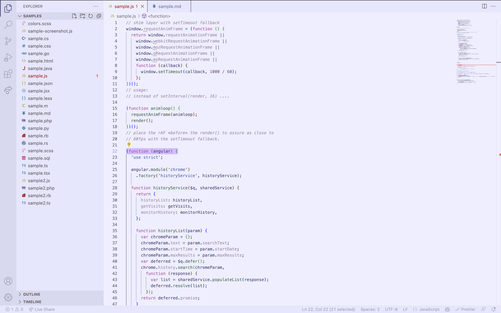
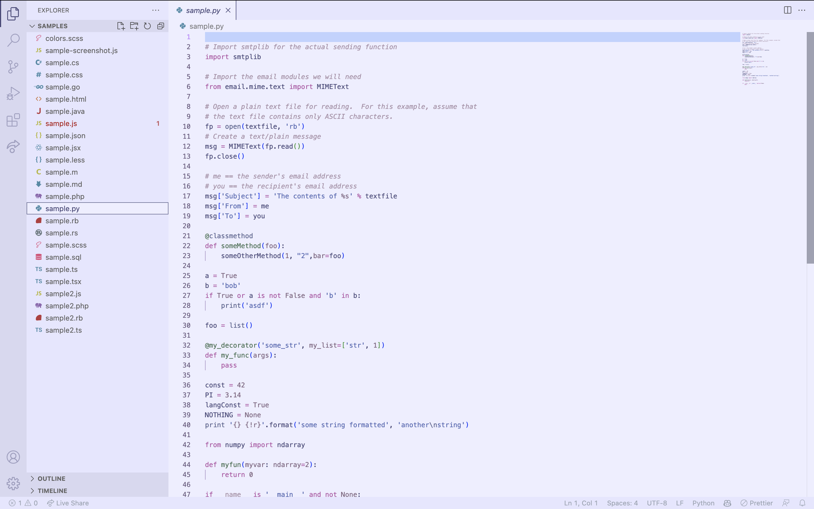
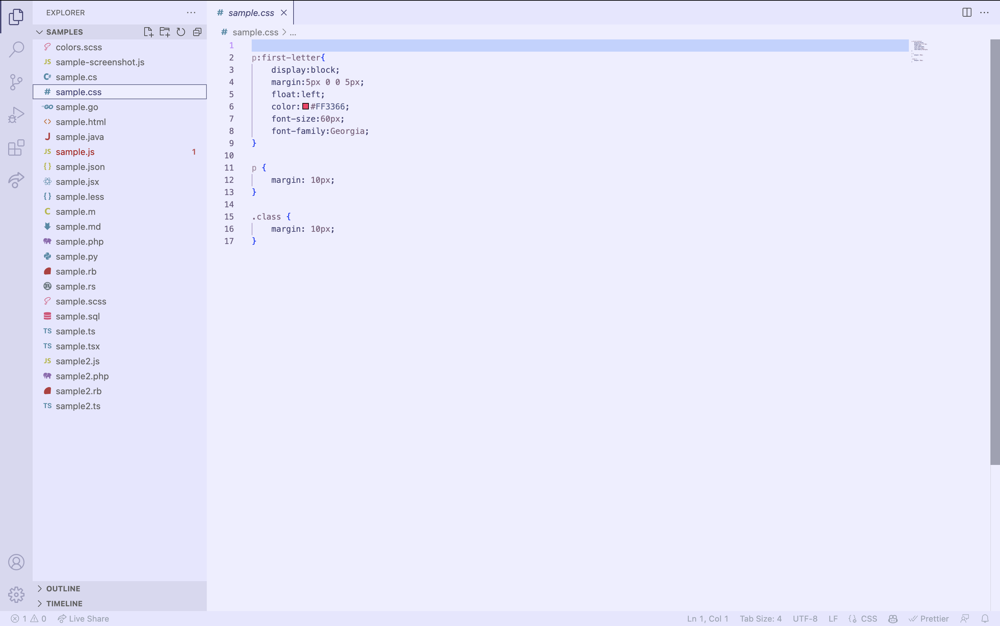
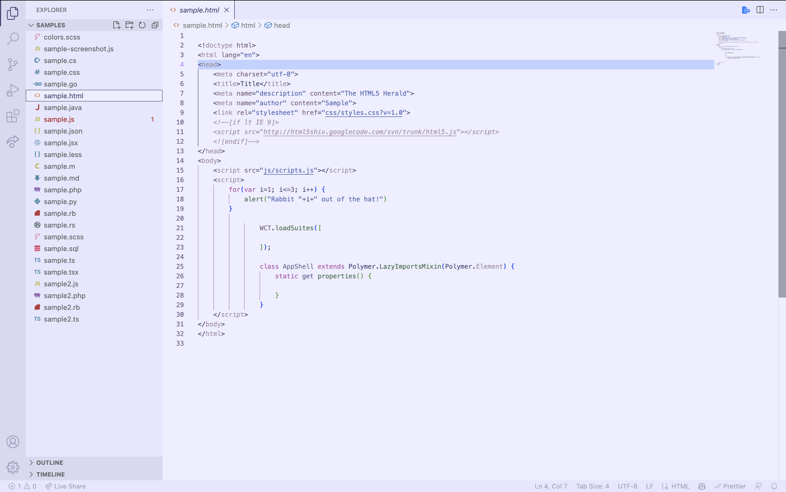
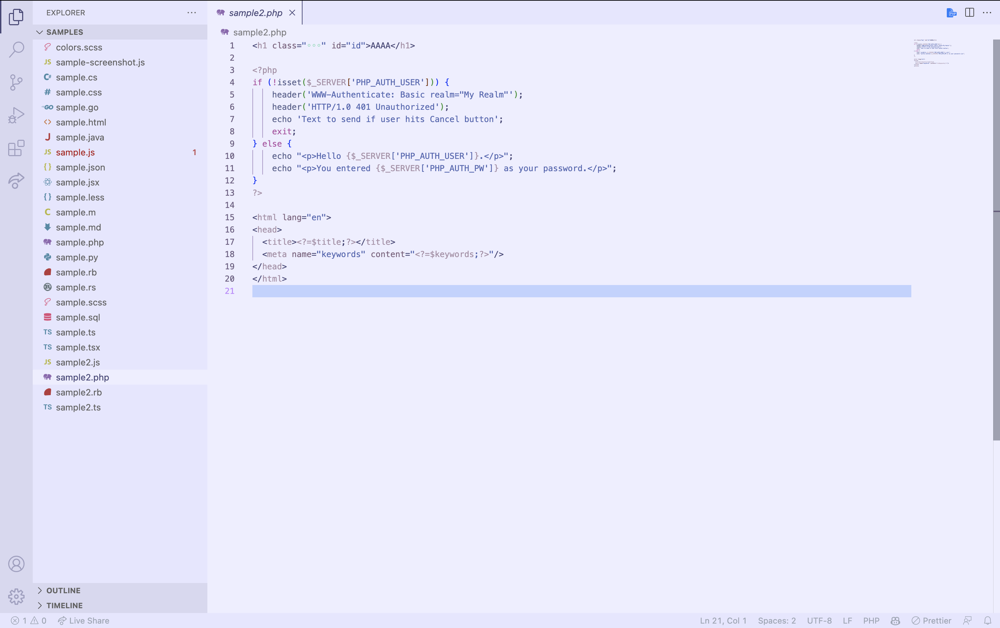

# God Is A Woman VS Code Theme

Do you want to feel like a queen while you code? Introducing the God Is a Woman theme for VS Code! Inspired by the beautiful color palette from Ariana Grande's music video, this theme will make you feel confident and powerful like the pop princess herself.

Whether you're a serious Arianator or just looking for a beautiful and functional theme, the God Is a Woman theme is the perfect addition to your workflow. Whether you're debugging complex algorithms or working with intricate data structures, the God Is a Woman theme will keep you energized and focused. Download God Is a Woman today and start coding like the queen you are!

## Syntax Palette
| Scope                | Color                                            | HEX     | RGB                |
| -------------------- | ------------------------------------------------ | ------- | ------------------ |
| Background           |  | #D8D8F0 | rgb(216, 216, 240) |
| Foreground           |  | #484878 | rgb(72, 72, 120)    |
| Comment              |  | #A890A8 | rgb(168, 144, 168) |
| Keyword              |  | #B252A4 | rgb(178, 82, 164)   |
| Function/Method      |  | #406C4F | rgb(64, 108, 79)   |
| Property             |  | #828997 | rgb(130, 137, 151)   |
| String               |  | #5267B2 | rgb(82, 103, 178)  |
| Number               |  | #7D627E | rgb(125, 98, 126)  |
| Constant             |  | #7D627E | rgb(125, 98, 126)  |
| Markup Tag           |  | #275fe4 | rgb(39, 95, 228)   |
| Markup Attribute     |  | #df631c | rgb(223, 99, 28)   |
| Class/Type/Interface |  | #6B6F95 | rgb(107, 111, 149)   |
| Operator/Punctuation |  | #A890A8 | rgb(168, 144, 168) |

## Screenshots
This theme is tested and compatible with JavaScript, Python, CSS, HTML, PHP, and many more! Here are just a few screenshots.

